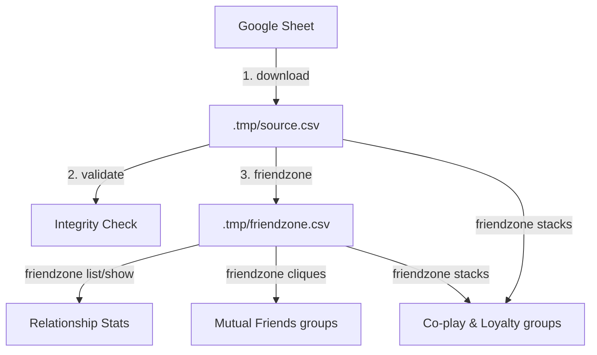

# Pipeline & Data Flow

1. **Download & Normalize**: Fetches raw PvP records from Google Sheets into `.tmp/source.csv`. During import, names are automatically resolved to canonical main names using configured `aliases` (e.g., merging spelling variants or alternative characters).
2. **Validate**: Runs quick local integrity checks to find duplicate records, check average match sizes, and warn if a single game ID has excessive rows.
3. **Analyze**: Compiles a flat matrix (`.tmp/friendzone.csv`) calculating pairwise **Friendship Indices** (ratio of same-team matches to total matches played together).
4. **Group Detection**:
   * **Cliques**: Employs the Bron–Kerbosch algorithm to locate maximal groups of mutual friends based on pairwise indexes.
   * **Stacks**: Performs multi-way co-occurrence analysis on team lists to score and rank close player groups based on actual same-team play volume and side loyalty.